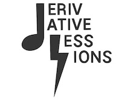

### Derivative Sessions - NFT Streaming Royalties

###

### Contributors:
Anthony Tilotta, Kate Peskova, Soren Wagner

###

Please note that this is a growing project and we aim to implement many functions for Derivative Sessions but as of now it's a music streaming platform that can be rewarding to both creators and fans who use the dApp. Creators can upload their music to IPFS and through our frontend fans will be able to stream their favorite Derivative Sessions music. Creators will gain streaming “Derivative Tokens” every time one of their songs or artwork is clicked on by a fan. Fans who stream the content will also be rewarded for their time spent enjoying the library of material. More Derivative “musicians” can be minted when the community agrees on a qualified musical candidate to be apart of the Derivative artist library. All Derivative musicians, in real life, are represented by their NFTs on the platform.
